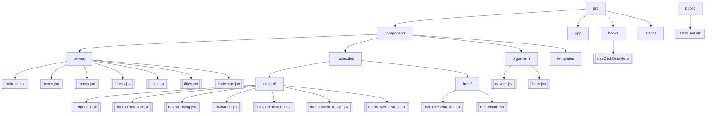

# 📂 Estructura del proyecto

Esta página describe la arquitectura de carpetas y archivos clave de **Contructora BIM**.

- **src/** – Código fuente de la aplicación.
  - **components/** – Implementación de componentes siguiendo Atomic Design.
    - **atoms/** – Componentes básicos e indivisibles (Title, Text, Button, Icon, Input, Label, TextArea).
    - **molecules/** – Combinaciones de átomos que forman unidades funcionales.
      - **navbar/** – NavBranding, NavMenu, BtnContactanos, MobileMenuToggle, MobileMenuPanel.
      - **hero/** – HeroPresentation, BtnAction.
    - **organisms/** – Secciones completas de UI que componen múltiples moléculas (Navbar, Hero).
    - **templates/** – Layouts de página reutilizables.
  - **hooks/** – Custom hooks de React reutilizables (useClickOutside).
  - **app/** – Rutas y páginas de Next.js (App Router).
  - **statics/** – Datos estáticos y constantes.
- **public/** – Recursos estáticos (imágenes, fuentes).
- **stories/** – Historias de Storybook por componente.
- **.storybook/** – Configuración de Storybook.
- **docs/** – Toda la documentación del proyecto (este directorio).
  - **components/** – Docs individuales por componente y por organismo.
  - **hooks/** – Docs individuales por hook.

---
> **Tip:** Mantén actualizada esta página cuando añadas o reorganices carpetas.
