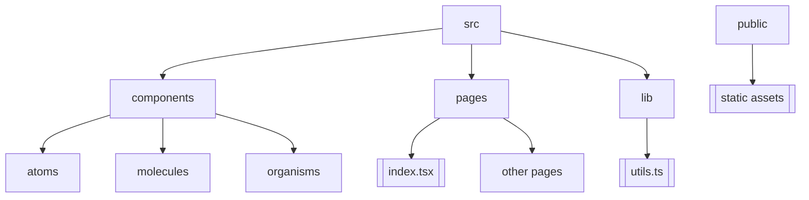

# 📂 Estructura del proyecto

Esta página describe la arquitectura de carpetas y archivos clave de **Contructora BIM**.

- **src/** – Código fuente de la aplicación.
  - **components/** – Implementación de componentes siguiendo Atomic Design.
    - **atoms/** – Componentes básicos (Title, Text, Button, etc.).
    - **molecules/** – Combinaciones de átomos (por ejemplo, `FormField`).
    - **organisms/** – Secciones completas de UI (por ejemplo, `Header`).
  - **pages/** – Rutas de Next.js.
  - **lib/** – Funciones utilitarias y lógica de negocio.
- **public/** – Recursos estáticos (imágenes, fuentes).
- **styles/** – Configuración de Tailwind y archivos CSS globales.
- **.storybook/** – Configuración de Storybook (ver sección *Storybook*).
- **docs/** – Toda la documentación del proyecto (este directorio).

---
> **Tip:** Mantén actualizada esta página cuando añadas o reorganices carpetas.
