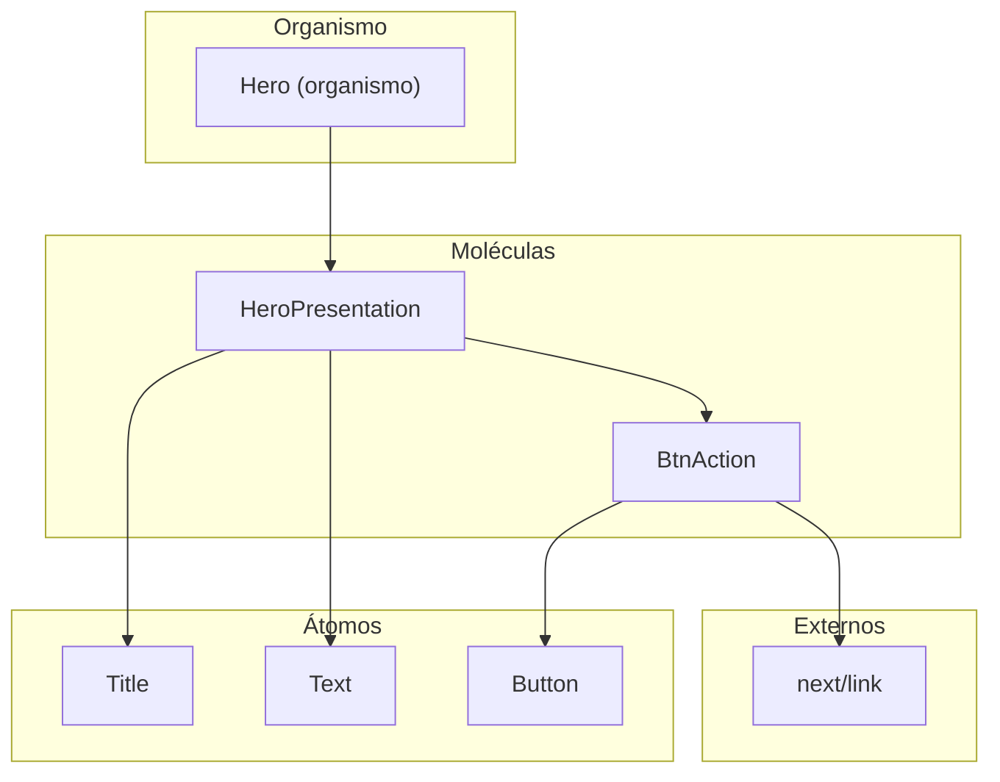

# Hero — Moléculas y Organismo

Esta página documenta todos los componentes del **Hero**, organizados por nivel de Atomic Design. El Hero es la sección principal de bienvenida (landing) de la página de inicio.

---

## Arquitectura del Hero



---

## Moléculas

### HeroPresentation (`<HeroPresentation />`)

**Archivo**: `molecules/hero/heroPresentation.jsx`

**Descripción**: Contenedor central del Hero que agrupa el título principal (`h1`), un párrafo descriptivo y los botones de acción. Se posiciona con `z-20` para quedar por encima del overlay oscuro del fondo.

#### Props

| Prop | Tipo | Default | Descripción |
| ---- | ---- | ------- | ----------- |
| —    | —    | —       | Actualmente no recibe props. Los textos están hardcodeados. |

#### Átomos utilizados

| Átomo  | Uso                                                                  |
| ------ | -------------------------------------------------------------------- |
| `Title` | Renderiza el `h1` con texto: *"Construimos el futuro con presisión BIM"* |
| `Text`  | Renderiza el párrafo descriptivo de la empresa                       |

#### Ejemplo

```jsx
import HeroPresentation from '@/components/molecules/hero/heroPresentation';

<HeroPresentation />
```

---

### BtnAction (`<BtnAction />`)

**Archivo**: `molecules/hero/btnsAction.jsx`

**Descripción**: Grupo de botones de llamada a la acción del Hero. Contiene dos `Button` envueltos en `next/link`: uno primario (*"Cotizar Proyecto"* → `/contact`) y uno secundario (*"Nuestros Proyectos"* → `/proyects`). Se adapta a columna en móvil y fila en `sm+`.

#### Props

| Prop | Tipo | Default | Descripción |
| ---- | ---- | ------- | ----------- |
| —    | —    | —       | Actualmente no recibe props. Los textos y rutas están hardcodeados. |

#### Átomos y dependencias

| Dependencia | Uso                                                        |
| ----------- | ---------------------------------------------------------- |
| `Button`    | Átomo de botón con variantes `primary` y `secondary`       |
| `next/link` | Navegación interna a `/contact` y `/proyects`              |

#### Ejemplo

```jsx
import BtnAction from '@/components/molecules/hero/btnsAction';

<BtnAction />
```

---

## Organismo

### Hero (`<Hero />`)

**Archivo**: `organisms/hero.jsx`

**Descripción**: Organismo de la sección hero/banner principal. Renderiza una `<section>` a pantalla completa (86vh) con una imagen de fondo mediante CSS `background-image`, un overlay oscuro semitransparente (`bg-gray-900/70`) y la molécula `HeroPresentation` centrada.

#### Props

| Prop | Tipo | Default | Descripción |
| ---- | ---- | ------- | ----------- |
| —    | —    | —       | Actualmente no recibe props. La imagen de fondo está hardcodeada vía URL externa. |

#### Estructura visual

```
┌─────────────────────────────────────────────────────────┐
│ section (relative, w-full, h-[86vh], overflow-hidden)   │
│                                                         │
│ ┌─────────────────────────────────────────────────────┐ │
│ │ div (imagen de fondo, bg-cover, z-0)                │ │
│ └─────────────────────────────────────────────────────┘ │
│                                                         │
│ ┌─────────────────────────────────────────────────────┐ │
│ │ div (overlay oscuro, bg-gray-900/70, z-10)          │ │
│ └─────────────────────────────────────────────────────┘ │
│                                                         │
│ ┌─────────────────────────────────────────────────────┐ │
│ │ HeroPresentation (z-20, centrado)                   │ │
│ │ ├── Title h1: "Construimos el futuro..."            │ │
│ │ ├── Text p: descripción de la empresa               │ │
│ │ └── BtnAction                                       │ │
│ │     ├── Button primary → /contact                   │ │
│ │     └── Button secondary → /proyects                │ │
│ └─────────────────────────────────────────────────────┘ │
└─────────────────────────────────────────────────────────┘
```

#### Capas z-index

| Capa | z-index | Contenido                     |
| ---- | ------- | ----------------------------- |
| Fondo | `z-0`  | Imagen de fondo (bg-cover)    |
| Overlay | `z-10` | Capa oscura semitransparente |
| Contenido | `z-20` | HeroPresentation (texto + botones) |

#### Ejemplo de uso

```jsx
import Hero from '@/components/organisms/hero';

export default function Home() {
  return (
    <main>
      <Hero />
    </main>
  );
}
```

---

## Integración en la página principal

El Hero se integra en `src/app/page.js` como el primer componente visible de la página de inicio:

```jsx
import Hero from "@/components/organisms/hero";

export default function Home() {
  return (
    <main>
      <Hero />
    </main>
  );
}
```

---

> 💡 **Nota para el equipo**: La imagen de fondo del Hero actualmente usa una URL externa. En una futura iteración, debería moverse a `/public/` o cargarse como asset local para mejor rendimiento y control de caché.
