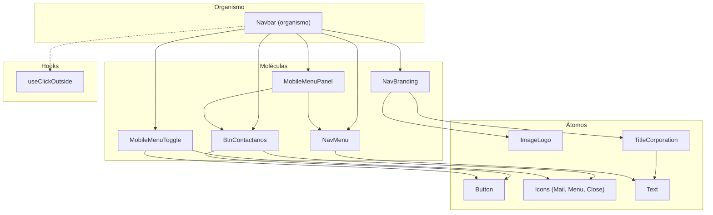

# Navbar — Moléculas y Organismo

Esta página documenta todos los componentes del **Navbar**, organizados por nivel de Atomic Design. El Navbar es el primer organismo completo del sistema de diseño.

---

## Arquitectura del Navbar



---

## Moléculas

### ImageLogo (`<ImageLogo />`)

**Archivo**: `molecules/navbar/imgLogo.jsx`

**Descripción**: Contenedor del logo corporativo. Renderiza un `next/image` dentro de un wrapper con fondo gris y bordes redondeados.

#### Props

| Prop | Tipo | Default | Descripción |
| ---- | ---- | ------- | ----------- |
| —    | —    | —       | Actualmente no recibe props. El logo está hardcodeado. |

#### Ejemplo

```jsx
import { ImageLogo } from '@/components/molecules/navbar/imgLogo';

<ImageLogo />
```

---

### TitleCorporation (`<TitleCorporation />`)

**Archivo**: `molecules/navbar/titleCorporation.jsx`

**Descripción**: Muestra el nombre corporativo en dos líneas ("BIM" + "CONSTRUCTIONS") usando el átomo `Title` con la fuente Bebas Neue.

#### Props

| Prop | Tipo | Default | Descripción |
| ---- | ---- | ------- | ----------- |
| —    | —    | —       | Actualmente no recibe props. Los textos están hardcodeados. |

#### Ejemplo

```jsx
import TitleCorporation from '@/components/molecules/navbar/titleCorporation';

<TitleCorporation />
```

---

### NavBranding (`<NavBranding />`)

**Archivo**: `molecules/navbar/navBranding.jsx`

**Descripción**: Agrupa `ImageLogo` + `TitleCorporation` como una unidad de branding clickeable que navega al home (`/`). Funciona como un solo bloque semántico.

#### Props

| Prop      | Tipo       | Default     | Descripción                                        |
| --------- | ---------- | ----------- | -------------------------------------------------- |
| `onClick` | `Function` | `undefined` | Callback al hacer clic (usado para cerrar el menú). |

#### Ejemplo

```jsx
import NavBranding from '@/components/molecules/navbar/navBranding';

<NavBranding onClick={() => console.log('clicked')} />
```

---

### NavMenu (`<NavMenu />`)

**Archivo**: `molecules/navbar/navMenu.jsx`

**Descripción**: Lista de enlaces de navegación que se adapta entre orientación horizontal (escritorio) y vertical (móvil). Usa el átomo `Text` y `tailwind-merge` para fusionar clases.

#### Props

| Prop          | Tipo       | Default        | Descripción                                                      |
| ------------- | ---------- | -------------- | ---------------------------------------------------------------- |
| `menu`        | `array`    | `[]`           | Array de objetos `{ id, href, text }` con los items del menú.    |
| `className`   | `string`   | `''`           | Clases Tailwind adicionales para el `<ul>` contenedor.           |
| `orientation` | `string`   | `'horizontal'` | Orientación del menú: `horizontal` o `vertical`.                 |
| `onItemClick` | `Function` | `undefined`    | Callback al hacer clic en un item (para cerrar menú móvil).      |

#### Ejemplo

```jsx
import NavMenu from '@/components/molecules/navbar/navMenu';

const menu = [
  { id: 1, href: '/servicios', text: 'Servicios' },
  { id: 2, href: '/proyectos', text: 'Proyectos' },
  { id: 3, href: '/nosotros', text: 'Nosotros' },
];

{/* Escritorio */}
<NavMenu menu={menu} className="hidden md:flex" orientation="horizontal" />

{/* Móvil */}
<NavMenu menu={menu} orientation="vertical" onItemClick={() => setIsOpen(false)} />
```

---

### BtnContactanos (`<BtnContactanos />`)

**Archivo**: `molecules/navbar/btnContactanos.jsx`

**Descripción**: Botón de llamada a la acción "Contáctanos" que combina un `Link` hacia `/contact` con el átomo `Button` (variante primary) y el icono `MailIcon`. Se reutiliza tanto en desktop como en móvil.

#### Props

| Prop        | Tipo       | Default | Descripción                                              |
| ----------- | ---------- | ------- | -------------------------------------------------------- |
| `className` | `string`   | `''`    | Clases Tailwind para el wrapper (controla visibilidad).   |
| `onClick`   | `Function` | `undefined` | Callback al hacer clic (para cerrar menú móvil).      |

#### Ejemplo

```jsx
import BtnContactanos from '@/components/molecules/navbar/btnContactanos';

{/* Desktop: se oculta en móvil */}
<BtnContactanos className="hidden md:block" />

{/* Móvil: cierra el menú al hacer clic */}
<BtnContactanos className="pt-4 px-2" onClick={closeMenu} />
```

---

### MobileMenuToggle (`<MobileMenuToggle />`)

**Archivo**: `molecules/navbar/mobileMenuToggle.jsx`

**Descripción**: Botón que alterna entre el icono hamburguesa (`MenuIcon`) y el de cierre (`CloseIcon`) para controlar la apertura/cierre del menú móvil. Solo visible en pantallas `< md`.

#### Props

| Prop       | Tipo       | Default     | Descripción                                  |
| ---------- | ---------- | ----------- | -------------------------------------------- |
| `isOpen`   | `boolean`  | —           | Estado actual del menú. Controla qué icono se muestra. |
| `onToggle` | `Function` | —           | Callback para alternar el estado del menú.   |

#### Ejemplo

```jsx
import MobileMenuToggle from '@/components/molecules/navbar/mobileMenuToggle';

<MobileMenuToggle 
  isOpen={isMenuOpen} 
  onToggle={() => setIsMenuOpen(!isMenuOpen)} 
/>
```

---

### MobileMenuPanel (`<MobileMenuPanel />`)

**Archivo**: `molecules/navbar/mobileMenuPanel.jsx`

**Descripción**: Panel desplegable que aparece debajo del header en móvil. Contiene el `NavMenu` en orientación vertical y el `BtnContactanos`. Se posiciona de forma absoluta respecto al header.

#### Props

| Prop      | Tipo       | Default | Descripción                                          |
| --------- | ---------- | ------- | ---------------------------------------------------- |
| `menu`    | `array`    | —       | Array de items de navegación (se pasa a `NavMenu`).   |
| `onClose` | `Function` | —       | Callback para cerrar el menú al hacer clic en un item. |

#### Ejemplo

```jsx
import MobileMenuPanel from '@/components/molecules/navbar/mobileMenuPanel';

{isMenuOpen && (
  <MobileMenuPanel menu={menuItems} onClose={() => setIsMenuOpen(false)} />
)}
```

---

## Organismo

### Navbar (`<Navbar />`)

**Archivo**: `organisms/navbar.jsx`

**Descripción**: Organismo principal de navegación. Orquesta todas las moléculas del navbar y gestiona el estado de apertura/cierre del menú móvil con el hook `useClickOutside`. Es un componente `"use client"`.

#### Props

| Prop   | Tipo    | Default | Descripción                                           |
| ------ | ------- | ------- | ----------------------------------------------------- |
| `menu` | `array` | —       | Array de objetos `{ id, href, text }` con la navegación. |

#### Estado interno

| Estado       | Tipo      | Descripción                                            |
| ------------ | --------- | ------------------------------------------------------ |
| `isMenuOpen` | `boolean` | Controla la visibilidad del menú móvil.                 |

#### Hooks utilizados

| Hook              | Propósito                                                    |
| ----------------- | ------------------------------------------------------------ |
| `useState`        | Gestión del estado `isMenuOpen`.                              |
| `useRef`          | Referencia al contenedor del menú para `useClickOutside`.     |
| `useCallback`     | Memoización de `closeMenu` para evitar re-renders.            |
| `useClickOutside` | Cierre automático del menú al hacer clic fuera del contenedor. |

#### Estructura visual

```
┌─────────────────────────────────────────────────────────┐
│ header (sticky, z-50, shadow)                           │
│ ┌─────────────────────────────────────────────────────┐ │
│ │ nav (container, h-20, flex justify-between)         │ │
│ │                                                     │ │
│ │ [NavBranding]  [NavMenu (desktop)]  [CTA + Toggle]  │ │
│ │                                                     │ │
│ └─────────────────────────────────────────────────────┘ │
│ ┌─────────────────────────────────────────────────────┐ │
│ │ MobileMenuPanel (absolute, solo visible en móvil)   │ │
│ │ ├── NavMenu (vertical)                              │ │
│ │ └── BtnContactanos                                  │ │
│ └─────────────────────────────────────────────────────┘ │
└─────────────────────────────────────────────────────────┘
```

#### Ejemplo de uso

```jsx
import Navbar from '@/components/organisms/navbar';

const menuItems = [
  { id: 1, href: '/servicios', text: 'Servicios' },
  { id: 2, href: '/proyectos', text: 'Proyectos' },
  { id: 3, href: '/nosotros', text: 'Nosotros' },
];

export default function Layout({ children }) {
  return (
    <>
      <Navbar menu={menuItems} />
      <main>{children}</main>
    </>
  );
}
```

---
